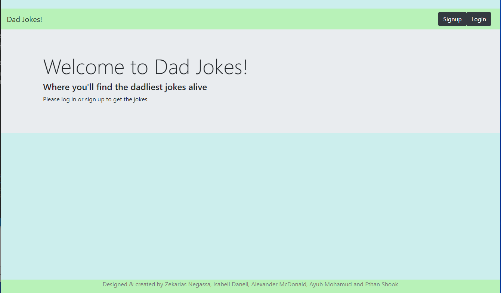

# Dad Jokes

## Table of Contents

- [Description](#Description)
- [Screen Shots](#Screen-Shots)
- [Usage](#usage)
- [Technology Used](#Technology-Used)
- [License](#license)

## Deployed Site
 [Click Here ](https://vast-gorge-32848.herokuapp.com/)

## Description

The Dad joke app is a website that allows users to read Dad jokes. The first part of the jokes are shown as list. To see the punchline the user clicks puchline button and the punchline is shown. The user has the ability to rate the joke and to add a joke a signup/login is required.  

## Screen-Shots

## Technology-Used

- HTML
- CSS
- Bootstrap
- JQuery
- Handlebars
- Javascript
- Passport for Authetication 
- MySQL
- Heroku - For deployment
- Node.js
- Express 

## License

## Question

**Email:** zakfena@gmail.com\
**Git Hub** https://github.com/ZAKFENA
